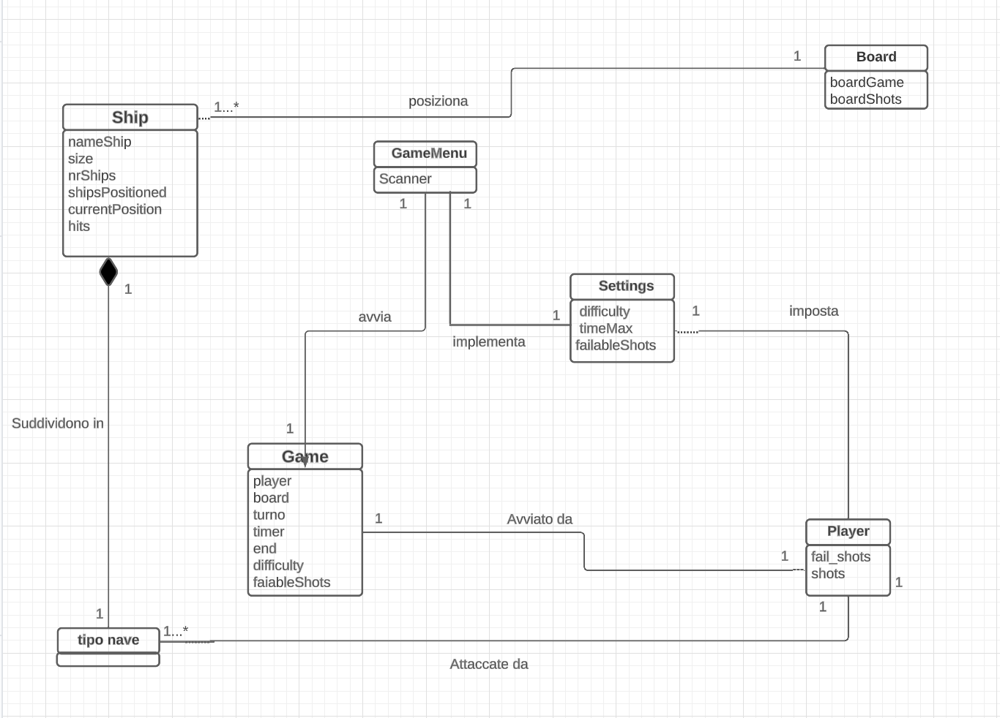
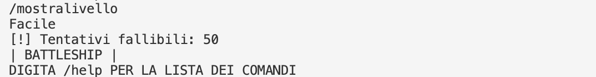
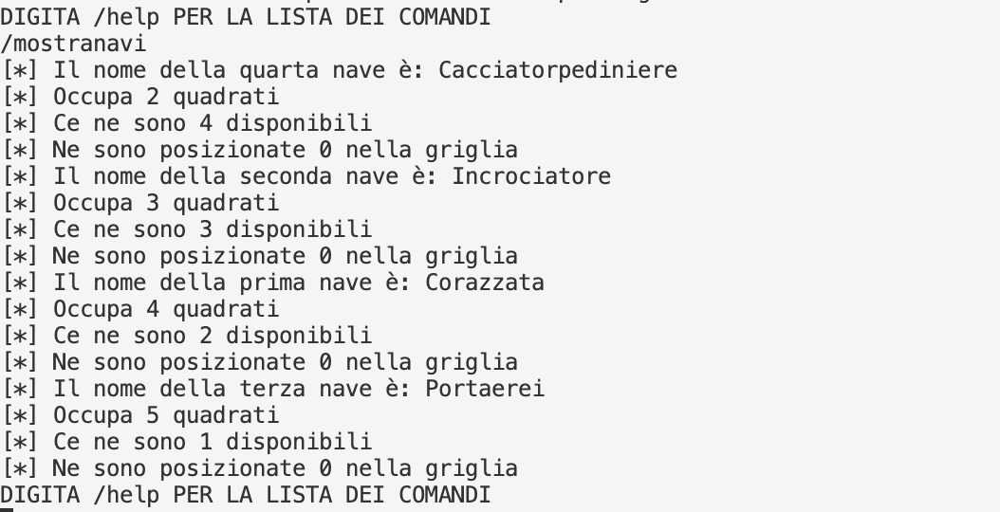
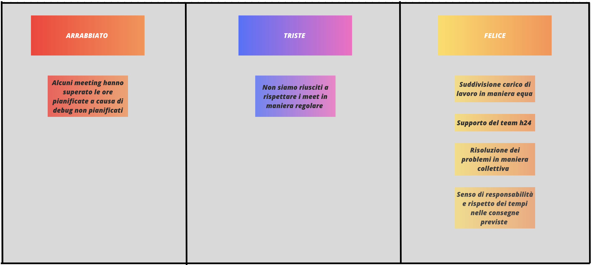

# Report
# Progetto Kay Ingegneria del software a.a. 22/23
# Report
## Indice
1. Introduzione
2. Modello di dominio
3. Requisiti specifici:
   1. Requisiti funzionali
   2. Requisiti non funzionali

7. Manuale Utente
9. Analisi retrospettiva
   1. Sprint 1

# 1. Introduzione

Il progetto riguarda le realizzazione del famoso gioco Battleship,in cui lo scopo è affondare tutte le navi nemiche prima che il tempo si esaurisca o che i tentativi disponibili diventino 0. 
Lo svolgimento del lavoro è stato diviso fasi principali (Sprint), che si ponevano degli obiettivi:

- Sprint 0: dimostrare familiarità con GitHub e il processo agile.
- Sprint 1: preparazione fasi iniziali game.

Il tempo di realizzazione dello Sprint 0 è stato dal 3 aprile 2023 al 14 Aprile 2023, lo Sprint 1 è stato dal 3 Maggio 2023 al 19 Maggio 2023.
Il lavoro è stato suddiviso equamente tra tutti i contributori del progetto :
Cassano Pietro, Arbues Raffaele, Conversano Giuseppe, Cristallo Corrado, Falcone Fabio.

# 2. Modello di dominio

# 3. Requisiti specifici
## 3.1 Requisiti funzionali

- Requisito funzionale 1:
 mostrare l'help con elenco comandi 

Criteri di accettazione 

Al comando /help o invocando l'app con flag --help o -h 

il risultato è una descrizione concisa, seguita dalla lista di comandi disponibili, uno per riga, come da esempio successivo: 

mostra navi	 

svela griglia 

esci 

- Requisito funzionale 2:
 chiudere il gioco 

Criteri di accettazione: 
Al comando /esci 

l'applicazione chiede conferma  

se la conferma è positiva, l'applicazione si chiude restituendo il controllo al sistema operativo 

se la conferma è negativa, l'applicazione si predispone a ricevere nuovi tentativi o comandi 

- Requisito funzionale 3:
 impostare il livello di gioco per variare il numero massimo di tentativi concessi 

Criteri di accettazione:

Al comando /facile  

l’applicazione risponde con OK e imposta a 50 il numero massimo di tentativi falliti 

 

Al comando /medio  

l’applicazione risponde con OK e imposta a 30 il numero massimo di tentativi falliti 

 

Al comando /difficile  

l’applicazione risponde con OK e imposta a 10 il numero massimo di tentativi falliti 

- Requisito funzionale 4:
 mostrare il livello di gioco e il numero di tentativi fallibili  

Criteri di accettazione: 

Al comando /mostralivello  

l’applicazione risponde visualizzando il livello di gioco e il numero di tentativi concessi 

- Requisito funzionale 5:
 mostrare i tipi di nave e il numero  

Criteri di accettazione: 

Al comando /mostranavi  

l’applicazione risponde visualizzando, per ogni tipo di nave, la dimensione in quadrati e il numero di navi da affondare: 

Cacciatorpediniere 	⊠⊠ 		esemplari: 4 

Incrociatore 		⊠⊠⊠ 		esemplari: 3  

Corazzata 		⊠⊠⊠⊠ 	esemplari: 2  

Portaerei  		⊠⊠⊠⊠⊠ 	esemplari: 1  

- Requisito funzionale 6:
iniziare una nuova partita 

 

Al comando `/gioca` 

se nessuna partita è in corso l'applicazione imposta causalmente le navi, in orizzontale o in verticale, si predispone a ricevere il primo tentativo o altri comandi. 

- Requisito funzionale 7:
 svelare la griglia con le navi posizionate 

 

Al comando /svelagriglia  

l’applicazione risponde visualizzando, una griglia 10x10, con le righe numerate da 1 a 10 e le colonne numerate da A a L, e tutte le navi posizionate   
#

## 3.2 Requisiti non funzionali
Requisito non funzionale 1 : 

il container docker dell’app deve essere eseguito da terminali che supportano Unicode con encoding UTF-8 o UTF-16.
Elenco di terminali supportati:
Linux:

- terminal

Mac OS:

- terminal

Windows:

- Powershell

- Git Bash (in questo caso il comando Docker ha come prefisso winpty; es: winpty docker -it ....)

# 7. Manuale d'uso
All’avvio il gioco si interfaccia con l’utente spiegando brevemente in cosa consiste; dopodiché è pronto a ricevere un nuovo comando, tra i seguenti:
- `/help`
- `/gioca`
- `/facile`
- `/medio`
- `/difficile`
- `/mostralivello`
- `/esci`

Prima di avviare una partita è necessario impostare il livello di difficoltà attraverso i comandi `/facile`
`/medio` e `/difficile` e succesivamente verificare il livello di gioco attraverso il comando
 `/mostralivello`

È ora possibile, tramite l’inserimento del comando `/gioca`, iniziare una nuova partita;
Il gioco, dopo aver implementato la difficoltà, posiziona casualmente le navi avversarie. 

## Posizionamento
Appena si avvia una nuova partita il gioco presenta a menù le navi disponibili con il comando `./mostranavi`.
Una volta vista la disponibilità è possibile capire quante navi mancano da affondare.

Se il numero di tentativi arriva a 0 la partita terminerà con una sconfitta.

# 9. Analisi retrospettiva
## 1. Sprint 1
