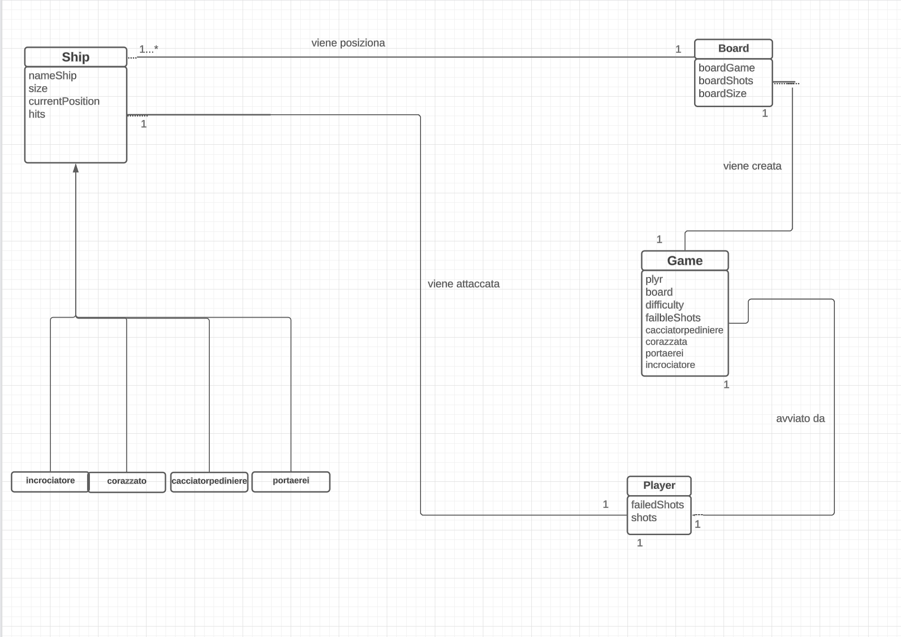
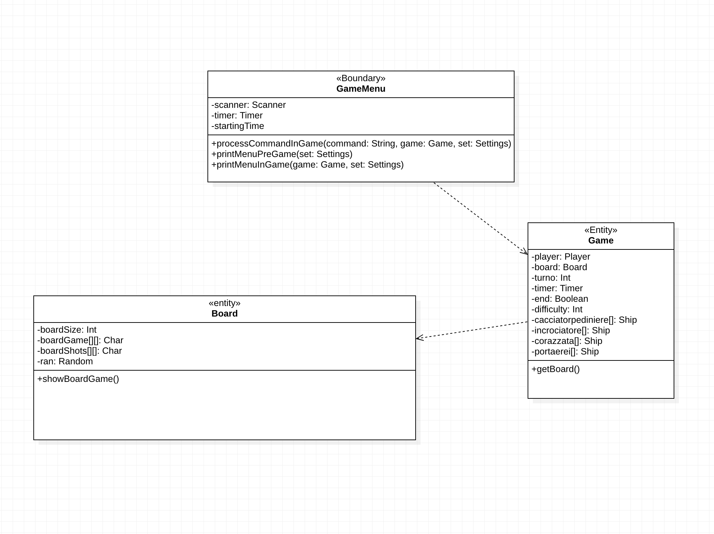
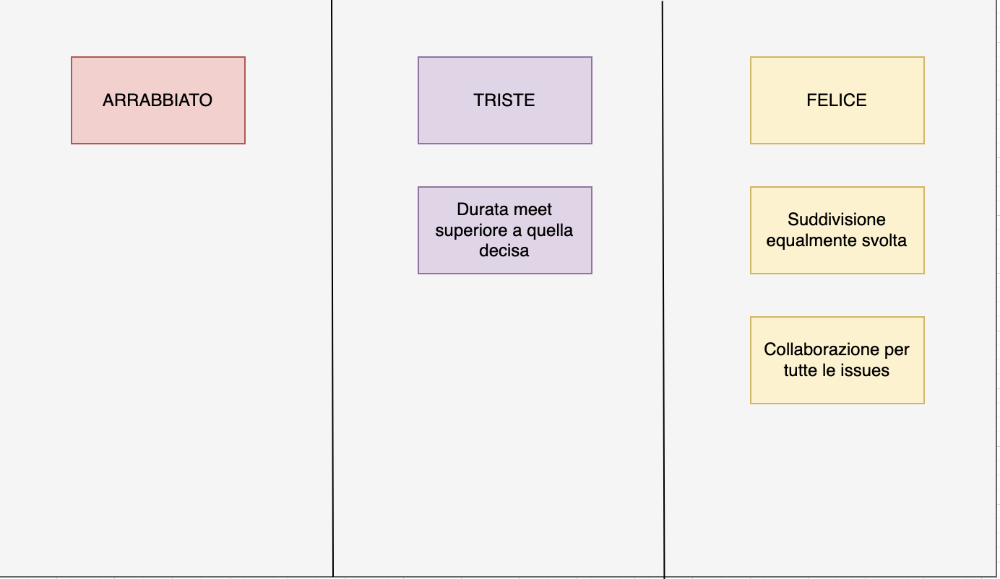

# Report
# Progetto Kay Ingegneria del software a.a. 22/23
## Indice
1. Introduzione
2. Modello di dominio
3. Requisiti specifici:
   1. Requisiti funzionali
   2. Requisiti non funzionali
4. System Design
5. OO Design
   1. Inizio Nuova Partita
   2. Mostrare i tipi di nave e il numero
   3. Esecuzione dell'attacco
   4. Abbandono partita
   5. Impostare il tempo di gioco
6. Riepilogo del test
7. Manuale Utente
8. Processo di sviluppo e organizzazione del lavoro
9. Analisi retrospettiva
    1. Sprint 0
    2. Sprint 1

# 1. Introduzione

Il progetto riguarda le realizzazione del famoso gioco Battleship,in cui lo scopo è affondare tutte le navi nemiche prima che il tempo si esaurisca o che i tentativi disponibili diventino 0. 
Lo svolgimento del lavoro è stato diviso fasi principali (Sprint), che si ponevano degli obiettivi:

- Sprint 0: dimostrare familiarità con GitHub e il processo agile.
- Sprint 1: preparazione fasi iniziali game.
- Sprint 2: Completare il gioco, assicurando la qualità del lavoro svolto

Il tempo di realizzazione dello Sprint 0 è stato dal 3 aprile 2023 al 14 Aprile 2023, lo Sprint 1 è stato dal 3 Maggio 2023 al 19 Maggio 2023 e lo Sprint 2 è stato dal 30 maggio 2023 al 14 giugno 2023;
Il lavoro è stato suddiviso equamente tra tutti i contributori del progetto :
Cassano Pietro, Arbues Raffaele, Conversano Giuseppe, Cristallo Corrado, Falcone Fabio.

# 2. Modello di dominio

# 3. Requisiti specifici
## 3.1 Requisiti funzionali

- Requisito funzionale 1:
mostrare l'help con elenco comandi 
Criteri di accettazione 
Al comando /help o invocando l'app con flag --help o -h 
il risultato è una descrizione concisa, seguita dalla lista di comandi disponibili, uno per riga, come da esempio successivo: 
mostra navi	 
svela griglia 
esci 

- Requisito funzionale 2:
 chiudere il gioco 
Criteri di accettazione: 
Al comando `/esci`
l'applicazione chiede conferma  
se la conferma è positiva, l'applicazione si chiude restituendo il controllo al sistema operativo 
se la conferma è negativa, l'applicazione si predispone a ricevere nuovi tentativi o comandi 

- Requisito funzionale 3:
 impostare il livello di gioco per variare il numero massimo di tentativi concessi 
Criteri di accettazione:
Al comando `/facile`  
l’applicazione risponde con OK e imposta a 50 il numero massimo di tentativi falliti 
Al comando `/medio` 
l’applicazione risponde con OK e imposta a 30 il numero massimo di tentativi falliti 
Al comando `/difficile`  
l’applicazione risponde con OK e imposta a 10 il numero massimo di tentativi falliti 

- Requisito funzionale 4:
 mostrare il livello di gioco e il numero di tentativi fallibili  
Criteri di accettazione: 
Al comando `/mostralivello`  
l’applicazione risponde visualizzando il livello di gioco e il numero di tentativi concessi 

- Requisito funzionale 5:
 mostrare i tipi di nave e il numero  
Criteri di accettazione: 
Al comando `/mostranavi` 
l’applicazione risponde visualizzando, per ogni tipo di nave, la dimensione in quadrati e il numero di navi da affondare: 
Cacciatorpediniere 	⊠⊠ 		esemplari: 4 
Incrociatore 		⊠⊠⊠ 		esemplari: 3  
Corazzata 		⊠⊠⊠⊠ 	esemplari: 2  
Portaerei  		⊠⊠⊠⊠⊠ 	esemplari: 1  

- Requisito funzionale 6:
iniziare una nuova partita 
Al comando `/gioca` 
se nessuna partita è in corso l'applicazione imposta causalmente le navi, in orizzontale o in verticale, si predispone a ricevere il primo tentativo o altri comandi. 

- Requisito funzionale 7:
 svelare la griglia con le navi posizionate 
Al comando `/svelagriglia` 
l’applicazione risponde visualizzando, una griglia 10x10, con le righe numerate da 1 a 10 e le colonne numerate da A a L, e tutte le navi posizionate   

- Requisito funzionale 8:
  impostare il numero massimo di tentativi falliti per livello di gioco
Al comando `/facilenumero`
l’applicazione rispondecon OK e imposta a numeroil numero massimo di tentativi falliti
Al comando `/medionumero`
l’applicazione rispondecon OK e imposta a numeroil numero massimo di tentativi falliti
Al comando `/difficilenumero`
l’applicazione rispondecon OK e imposta a numeroil numero massimo di tentativi falliti

- Requisito funzionale 9: 
  impostare direttamente il numero massimo di tentativi che si possono fallire
Al comando `/tentativinumero`
l’applicazione rispondecon OK e imposta a numeroil numero massimo di tentativi falliti

- Requisito funzionale 10:
 impostare la taglia della griglia
Al comando `/standard`
l’applicazione risponde con OK e imposta a 10x10 la dimensione della griglia
Al comando `/large`
l’applicazione risponde con OK e imposta a 18x18la dimensione della griglia
Al comando `/extralarge`
l’applicazione risponde con OK e imposta a 26x26la dimensione della griglia

- Requisito funzionale 11:
 impostare il tempo di gioco
Al comando `/temponumero`
l’applicazione risponde con OK e imposta a numeroil numero minuti a disposizione per giocare

- Requisito funzionale 12:
 mostrare il tempo di gioco 
Al comando `/mostratempo`
l’applicazione risponde visualizzando il numero di minuti trascorsi nel gioco e il numero di minuti ancora disponibili

- Requisito funzionale 13:
 effettuare un tentativo per colpire una nave
Digitando una coppia di caratteri separati da un trattino (es. 4-B),
l’applicazione risponde 
•“acqua” se sulla cella non è posizionata nessuna nave;
•"colpito" se sulla cella è posizionata una nave;
•"colpito e affondato" se sulla cella è posizionata una nave ed è l’ultima cella non colpita della nave.
Qualunque sia l’esito del tentativo, l’applicazione mostra la griglia con le navi colpite parzialmente o affondate, il numero di tentativi già effettuati, e il tempo trascorso.
La partita termina con successo se il tentativo ha affondato l’ultima nave.
La partita termina con insuccesso se è stato raggiunto il numero massimo di tentativi falliti o seè scaduto il tempo di gioco.

-Requisito funzionale 14: 
 mostrare la griglia con le navi colpite e affondate
Al comando `/mostragriglia`
l’applicazione risponde visualizzando, una griglia con le righe numerate a partire da 1 e le colonne numerate a partire da A, con le navi affondate e le sole parti già colpite delle navi non affondate.

- Requisito funzionale 15:
 mostrare il numero di tentativi già effettuati e il numero di tentativi falliti
Al comando `/mostratentativi`
l’applicazione risponde visualizzando il numero di tentativi già effettuati,il numero di tentativi falliti e il numero massimo di tentativi falliti

- Requisiti funzionali 16:
 abbandonare una partita
Al comando `/abbandona`
l'applicazione chiede conferma 
•se la conferma è positiva, l’applicazione risponde visualizzandosulla grigliala posizione di tutte le navi e si predispone a ricevere nuovi comandi
•se la conferma è negativa, l'applicazione si predispone a ricevere nuovi tentativi o comand

## 3.2 Requisiti non funzionali
Requisito non funzionale 1 : 

il container docker dell’app deve essere eseguito da terminali che supportano Unicode con encoding UTF-8 o UTF-16.
Elenco di terminali supportati:
Linux:

- terminal

Mac OS:

- terminal

Windows:

- Powershell

- Git Bash (in questo caso il comando Docker ha come prefisso winpty; es: winpty docker -it ....)

**Comando per l’esecuzione del container**
Dopo aver eseguito il comando docker pull copiandolo da GitHub Packages, Il comando Docker da usare per eseguire il
container contenente l’applicazione è:

> docker run --rm -it docker.pkg.github.com/softeng2122-inf-uniba/provaprogetto2223-prova/prova:latest

# 4. System Design
Questa sezione non è compilata perchè si tratta di un progetto di piccole-medie dimensioni per tanto il gruppo dopo un'analisi del problema ha opportunamente deciso che non avrebbe avuto senso esplicitare un design del sistema.

# 5. OO Design

## 5.1 Inizio Nuova Partita

### Diagramma delle classi
  
### Diagramma di sequenza
  

## 5.2 Mostrare i tipi di nave e il numero

### Diagramma delle classi
  
### Diagramma di sequenza
  

## 5.3 Esecuzione dell'attacco

### Diagramma delle classi
  
### Diagramma di sequenza
  

## 5.4 Abbandono della partita

### Diagramma delle classi
  
### Diagramma di sequenza
  

## 5.5 Impostare il tempo di gioco 

### Diagramma delle classi
  
### Diagramma di sequenza
  

# 6. Riepilogo del test

# 7. Manuale utente
## Pre-Game
All’avvio il gioco si interfaccia con l’utente spiegando brevemente in cosa consiste; dopodiché è pronto a ricevere un nuovo comando, tra i seguenti:
- `/help`
- `/gioca`
- `/facile`
- `/medio`
- `/difficile`
- `/standard`
- `/large`
- `/extralarge`
- `/mostralivello`
- `/esci`

Prima di avviare una partita è necessario impostare il livello di difficoltà attraverso i comandi `/facile`
`/medio` e `/difficile` e succesivamente verificare il livello di gioco attraverso il comando
 `/mostralivello`

Prima di avviare una partita è necessario impostare la dimensione della griglia attraverso i comandi `/standard` `/large` ed `/extralarge`.

## In-Game
- `/svelagriglia`
- `/mostranavi`
- `/mostragriglia`
- `attacco (es. 4-B)`
- `/abbandona`
Appena si avvia una nuova partita il gioco presenta a menù le navi disponibili con il comando `./mostranavi`.
Una volta vista la disponibilità è possibile capire quante navi mancano da affondare.

È ora possibile, tramite l’inserimento del comando `/gioca`, iniziare una nuova partita;
Il gioco, dopo aver implementato la difficoltà, posiziona casualmente le navi avversarie ed osservarle attraverso il comando `/svelagriglia`. 

E' possibile osservare la griglia di gioco con le navi colpite o affondate attraverso il comando `/mostragriglia`

Per quanto riguarda la fase di attacco basterà digitare le coordinate partendo dalla riga scelta (es. 5-C) ed una volta inserito verrà verificato se si è colpita una nave oppure acqua.

Se il numero di tentativi arriva a 0 la partita terminerà con una sconfitta.

# 8. Processo di sviluppo e organizzazione del lavoro

Il gruppo Kay per la realizzazione di questo progetto si è organizzato seguendo il [codice di condotta](./CODE_OF_CONDUCT.md).

Il gruppo si è coordinato utilizzando le piattaforme di comunicazione Whatsapp,  Discord e Microsoft Teams sui quali venivano condivisi file, immagini e documentazioni oltre che problemi incontrati durante lo sviluppo. Nello specifico su Whatsapp venivano decisi meeting da farsi periodicamente in aggiunta a quelli straordinari quando venivano sollevate questioni importanti, i meeting erano poi svolti sulla piattafroma Discord sul quale è stato creato un server privato di comunicazione contenente diversi canali per mantenere ordine e organizzazione al massimo. 
Nello specifico i meeting periodici venivano svolti ogni giorno ed avevano la durata di 50/60 minuti, nei quali si aggiornavano i membri del gruppo dello stato di avanzamento dei propri issue e si lavorava collettivamente su issue iù complesse o su problemi tecnici di rilevanza MAJOR. 

# 9. Analisi retrospettiva

## 1. Sprint 0

## 2. Sprint 1
